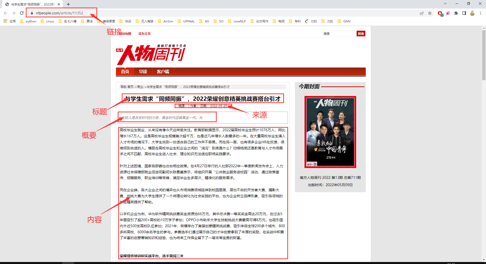

# 南方人物周刊爬虫

## 类别
```python
    category_dict = {
            1:"封面人物1", 2:"报道", 3:"非虚构", 4:"图片故事", 5:"专栏",
            6:"后窗", 7:"评论", 8:"虚构", 9:"视觉", 10:"经典",
            11:"酷生活", 12:"封面人物2", 14:"世界观", 15:"历史", 16:"封面人物",
            21:"社会", 22:"商业", 23:"文化", 24:"明星", 25:"国际",
    }
```

以 __[报道](https://www.nfpeople.com/category/2)__ 为例， 对应URL为 `https://www.nfpeople.com/category/2`

## 运行
```python
python nfpeople.py
```

## 数据
- ./南方人物周刊/--链接.txt：每个类别下所有文章的链接
- ./南方人物周刊/--.csv：爬取文章的内容，包含字段: `[标题，来源，概要，内容，链接]`



